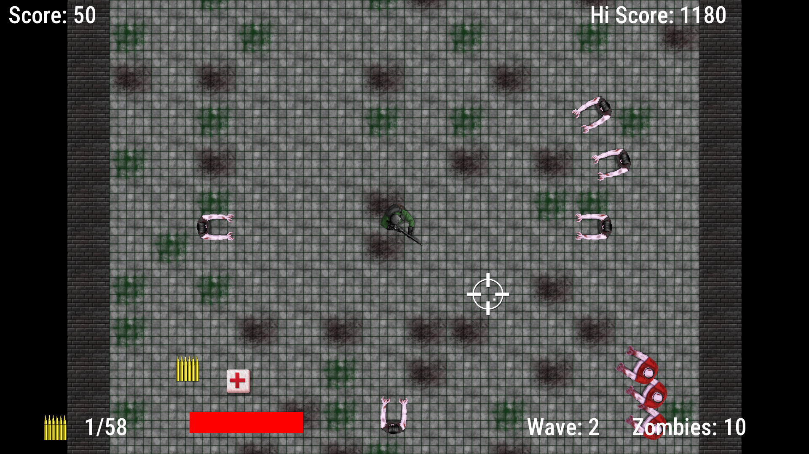
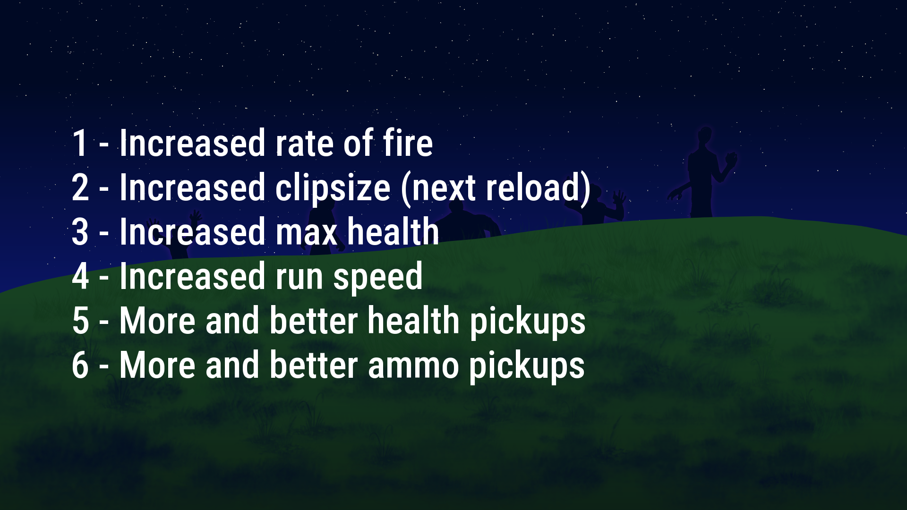

# Enhanced Zombie Arena with SFML 3
 This project is my implementation of the game **Zombie Arena** from the book *Beginning C++ Game Programming* by John Horton. As such, the code is mostly at the level of the lessons from the book. There are many changes though, the most obvious one being the use of SFML v3.0.2. 
 
 The idea is simple, an arcade top-down shooter where the player progresses through waves of zombies. Each new wave has both a greater number of zombies as well as a bigger arena. At the end of each wave the player chooses a feature to upgrade. 

### Added Features

- 🛠️ SFML v3.0.2.
- 🛠️ Uses Mersenne Twister for randomness.
- 🎵 Footsteps sound for the player.
- 🎵 Zombie sounds were also added.
- 💡 Improved collision detection.
- 💡 Improved gun reloading logic (the book one is flawed).
- 📐 Improved bullets speed with a bit of Linear Algebra.
- 🎨 Custom game art. 
 

### How it looks





### Gameplay Video
[▶️ Watch on YouTube](to do)

### Project Goals
- Practice C++ fundamentals in a real project.
- Adapt legacy code to a newer version of SFML.
- Gain experience with rendering, audio, input handling, physics, and asset pipelines.
- Build a complete, finished game from scratch.

### What I learned
If you are following the book you can expect to learn:
#### C++
- Classes and objects
- References and pointers
- Dynamically allocated memory (and how to prevent
it from leaking)
- Singleton classes
- STL maps
- Writing and reading from a file

#### SFML
- The class VertexArray
- Dealing with multiple views system for game world, maps and HUD
- Controlling game camera
- Collision detection 

### Technologies
- C++
- SFML 3.0.2
- Visual Studio Code
- Clang
- Linux
- Krita

### How to Build and Run
Make sure you have SFML 3.0.2 in your system and Clang or other C++ compiler. Extract the directory,
*cd* into it and use this code (Clang version):
```clang++ *.cpp -o zombie -lsfml-graphics -lsfml-window -lsfml-system -lsfml-audio```

Then to run it you may just double-click *zombie* or via terminal ``./zombie``.

### Credits
- John Horton's book Beginning C++ Game Programming
- Audio assets came from https://pixabay.com/ 
- Thanks to the Krita project for their amazing work: https://krita.org 
- All original artwork drawn specifically for this project (P.S. I'm not an artist)


### License
GPLv2
